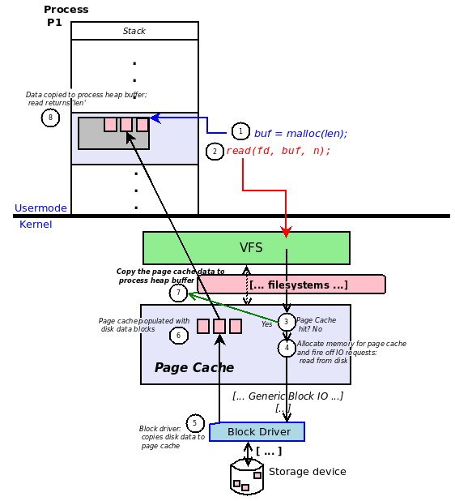

# Page Cache HIT/MISS Experiment

This experiment demonstrates that Linux uses a **shared page cache** when multiple processes access the same file.

The experiment uses two processes that access the same `data.bin` file. The first process should cause a **page-cache MISS**, while the second process should find the page already in the page cache and produce a **page-cache HIT**.

Before starting the experiment, **open three terminal windows**:

1. **Terminal 1 — Kernel Module and Log**  
   Use this terminal to load the kernel module and monitor the kernel log for page-cache HIT/MISS messages.

2. **Terminal 2 — Process A**  
   Use this terminal to run the first `mapfile` process.

3. **Terminal 3 — Process B**  
   Use this terminal to run the second `mapfile` process.

Keep all three terminals open throughout the experiment so that you can observe the interaction between the two processes and the kernel module.

## 0. Linux Page Cache

The following diagram provides an overview of how the Linux page cache sits between processes and the underlying file system/storage:



The page cache keeps recently accessed file data in memory. When multiple processes access the same file, they can use the same cached file pages, avoiding repeated reads from storage. In this experiment, we will observe this behavior directly by accessing the same file from two processes.

---

## 1. Build the Kernel Module - on Terminal 1

Build the module:

```bash
make clean
make
```

This should produce:

```text
pagecache_probe.ko
```

The kernel module adds two probe handlers to kernel functions involved in file access. These probes monitor accesses to the file specified by the inode number and determine whether the requested file data is already present in the Linux page cache (a page-cache hit) or is not present and must be loaded into the page cache (a page-cache miss). The module reports the detected hits and misses in the kernel log, allowing us to observe page-cache behavior without modifying the application itself.

---

## 2. Find the Inode Number (Terminal 1)

Find the inode number of `data.bin`:

```bash
ls -li data.bin
```

For example:

```text
1502784 -rw-r--r-- 1 test test 4096 Sep 26 12:00 data.bin
```

The first number is the inode number:

```text
1502784
```

You can also use:

```bash
stat data.bin
```

and look for the `Inode` field.

---

## 3. Load the Kernel Module (Terminal 1)

Load the module and provide the inode number:

```bash
sudo insmod pagecache_probe.ko inode=1502784
```

Replace `1502784` with the inode number of your own `data.bin`.

Verify that the module loaded:

```bash
sudo dmesg | tail
```

You should see:

```text
PAGECACHE: probes loaded for inode=1502784
```

---

## 4. Clear the Page Cache (Terminal 1)

Before starting the experiment, clear the page cache:

```bash
sudo sh -c 'echo 1 > /proc/sys/vm/drop_caches'
```

This ensures that the first process starts with the file page absent from the page cache.

---

## 5. Run the First Process - on Terminal 2

Run the first `mapfile` process using the experiment's normal command.

For example:

```bash
./mapfile
```

Then check the kernel messages (on Terminal 1):

```bash
sudo dmesg | grep PAGECACHE
```

You should see a message similar to:

```text
PAGECACHE: PAGE CACHE MISS pid=6263 inode=1502784 index=0
```

The PID will be different on your system.

This indicates that the requested file page was not already in the page cache.

---

## 6. Run the Second Process - on Terminal 3

Without clearing the page cache again, run a second `mapfile` process:

```bash
./mapfile
```

Then check (on Terminal 1):

```bash
sudo dmesg | grep PAGECACHE
```

You should now see something similar to:

```text
PAGECACHE: PAGE CACHE MISS pid=6263 inode=1502784 index=0
PAGECACHE: PAGE CACHE HIT pid=6264 inode=1502784 index=0
```

The PIDs will be different on your system.

The important observation is:

```text
First process  -> PAGE CACHE MISS
Second process -> PAGE CACHE HIT
```

---

## 7. Repeat the Experiment

To repeat the experiment from a clean state, first stop any existing `mapfile` processes.

### 1. Stop existing `mapfile` processes

In Terminals 2 and 3, press:

```text
Ctrl+C
```

### 2. Clear the page cache (Terminal 1)

```bash
sudo sh -c 'echo 1 > /proc/sys/vm/drop_caches'
```

### 3. Run the first process (Terminal 2)

```bash
./mapfile
```

### 4. Run the second process (Terminal 3)

```bash
./mapfile
```

### 5. Check the results (Terminal 1)

```bash
sudo dmesg | grep PAGECACHE
```

You should again observe one MISS followed by one HIT.

---

## 8. What Does This Demonstrate?

The experiment demonstrates that the page cache is **shared between processes**.

Conceptually:

```text
             Process 1
                 |
                 |
                 v
        +----------------+
        |   Page Cache   |
        |                |
        |   data.bin     |
        |   page 0       |
        +----------------+
                 ^
                 |
                 |
             Process 2
```

The first process causes the file page to be brought into the page cache.

When the second process accesses the same file page, Linux can reuse the page that is already present in the page cache rather than loading another copy of the file from storage.

### Important observation

The two processes are still separate processes with separate virtual address spaces.

The experiment demonstrates:

> **The page cache is shared, even though each process has its own address space and page tables.**

---

## 9. Cleanup (Terminal 1)

When finished, unload the kernel module:

```bash
sudo rmmod pagecache_probe
```

Verify:

```bash
sudo dmesg | tail
```

You should see:

```text
PAGECACHE: probes unloaded
```
